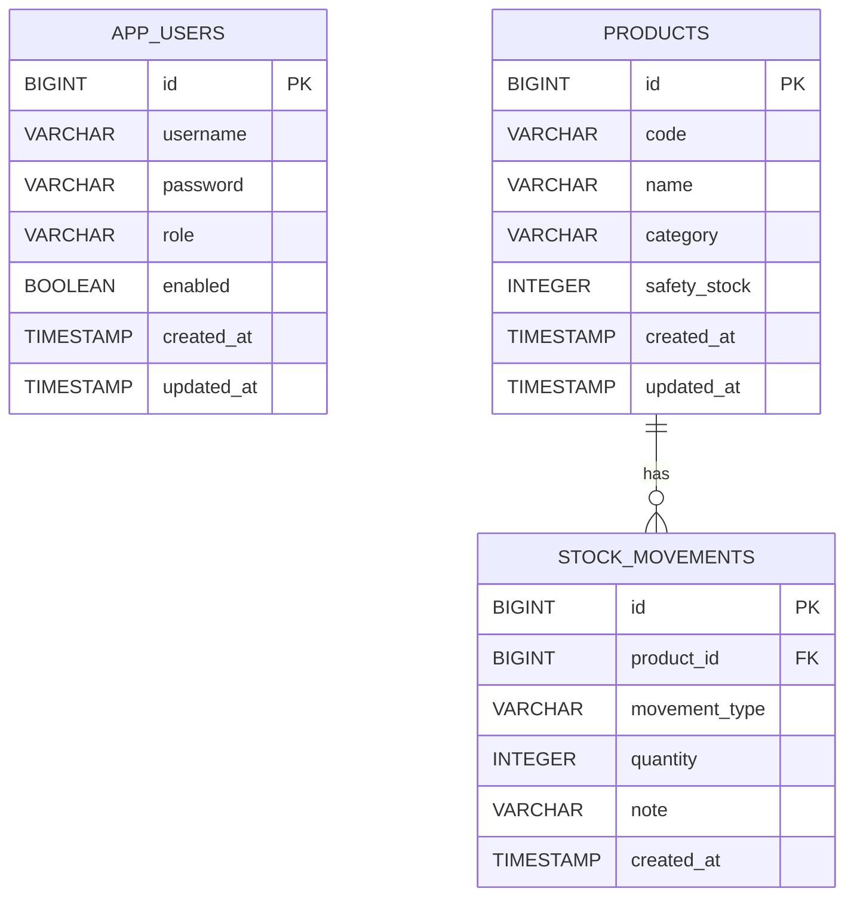

# InventoryManager

Spring Boot と MyBatis で作成している在庫管理システムです。

商品マスタ、入庫、出庫、在庫一覧、在庫検索、在庫アラート、CSV出力を扱います。`JobManager`、`AttendanceManager` に続く業務システム系ポートフォリオとして、SQL設計、トランザクション、集計処理、認証を学べる構成にしています。

## 概要

InventoryManager は、商品ごとの在庫数を入出庫履歴から集計するWebアプリケーションです。

Spring Data JPAではなく MyBatis を採用し、SQLを明示的に書くことで、JOIN、GROUP BY、CASE式、DTOマッピングを学習できるようにしています。

## 主な機能

- DB認証によるログイン / ログアウト
- ユーザー一覧表示
- ユーザー登録
- ADMIN権限によるユーザー管理画面のアクセス制御
- 権限ごとの操作制御
- 商品登録
- 商品編集
- 商品削除
- 商品一覧表示
- 商品検索
- 商品一覧ページネーション
- 入出庫履歴がある商品の削除制御
- 入庫登録
- 出庫登録
- 出庫時の在庫不足チェック
- 入出庫履歴表示
- 入出庫履歴検索
- 在庫一覧表示
- 在庫検索
- 安全在庫数による在庫アラート
- 在庫一覧CSV出力
- 初期サンプルデータ投入
- Docker Compose によるアプリケーションとPostgreSQLの同時起動

## 使用技術

- Java 21
- Spring Boot 3.5.15
- Spring Web
- Spring Security
- Thymeleaf
- MyBatis
- PostgreSQL
- Maven
- Docker Compose
- JUnit 5
- Mockito

## MyBatisで学べるポイント

- MapperインターフェースとXML Mapperの対応
- SQLを自分で記述するRepository層
- `JOIN` による商品と入出庫履歴の結合
- `GROUP BY` と `SUM` による在庫数集計
- `CASE` 式による入庫・出庫の加減算
- DTO `StockSummary` への集計結果マッピング
- `LIMIT` / `OFFSET` によるページネーション
- `@Transactional` による入出庫処理の整合性確保

## ディレクトリ構成

```text
src/main/java/com/example/inventorymanager
├── config
│   └── SecurityConfig.java
├── controller
│   ├── LoginController.java
│   ├── ProductController.java
│   ├── StockController.java
│   └── UserController.java
├── dto
│   ├── PageResult.java
│   ├── StockSummary.java
│   └── UserForm.java
├── entity
│   ├── AppUser.java
│   ├── MovementType.java
│   ├── Product.java
│   └── StockMovement.java
├── mapper
│   ├── AppUserMapper.java
│   ├── ProductMapper.java
│   └── StockMovementMapper.java
└── service
    ├── AppUserService.java
    ├── DatabaseUserDetailsService.java
    ├── ProductService.java
    ├── StockCsvService.java
    └── StockMovementService.java
```

```text
src/main/resources
├── mappers
│   ├── AppUserMapper.xml
│   ├── ProductMapper.xml
│   └── StockMovementMapper.xml
├── static/css/app.css
├── templates
│   ├── login.html
│   ├── products
│   ├── stocks
│   └── users
├── application.properties
├── application-docker.properties
├── schema.sql
└── data.sql
```

## DB設定

通常起動では `src/main/resources/application.properties` で PostgreSQL に接続します。

```properties
spring.datasource.url=jdbc:postgresql://localhost:5432/inventorymanager
spring.datasource.username=postgres
spring.datasource.password=${DB_PASSWORD}
mybatis.mapper-locations=classpath:mappers/*.xml
mybatis.configuration.map-underscore-to-camel-case=true
```

DBパスワードは環境変数 `DB_PASSWORD` に設定します。

```powershell
$env:DB_PASSWORD="your_postgres_password"
```

## 通常起動

PostgreSQL に `inventorymanager` データベースを作成します。

```sql
CREATE DATABASE inventorymanager;
```

プロジェクト直下で起動します。

```powershell
.\mvnw.cmd spring-boot:run
```

ブラウザでアクセスします。

```text
http://localhost:8080/products
```

## Docker Composeでの起動

Docker Desktop が起動している状態で、プロジェクト直下から実行します。

```powershell
docker compose up --build
```

アプリケーションとPostgreSQLがまとめて起動します。

```text
http://localhost:8081/products
```

Docker Composeでは、ホスト側のポートを次のように割り当てています。

```text
アプリケーション: localhost:8081
PostgreSQL: localhost:5433
```

停止する場合:

```powershell
docker compose down
```

## pgAdmin接続情報

Docker Composeで起動したPostgreSQLをpgAdminから確認する場合は、次の値で接続します。

```text
Host: localhost
Port: 5433
Database: inventorymanager
Username: postgres
Password: postgres
```

## テスト実行

Pleiades側のJava 21を使ってテストを実行するためのスクリプトを用意しています。

```powershell
.\scripts\test.ps1
```

## 初期ユーザー

ユーザー情報は `app_users` テーブルで管理します。初期データとして管理者ユーザーを投入しています。

```text
ユーザー名: admin
パスワード: password
権限: ADMIN
```

パスワードはBCryptでハッシュ化してDBに保存しています。

## 権限制御

`ADMIN` と `USER` の2種類の権限を使用します。

```text
ADMIN: 商品マスタ管理、ユーザー管理、在庫確認、入出庫登録
USER: 在庫確認、入出庫登録
```

`USER` は商品登録、商品編集、商品削除、ユーザー管理画面へアクセスできません。画面上の管理操作ボタンも権限に応じて非表示にします。

## 画面

- `/login` ログイン画面
- `/users` ユーザー管理画面
- `/users/new` ユーザー登録画面
- `/products` 商品一覧画面
- `/products/new` 商品登録画面
- `/products/{id}/edit` 商品編集画面
- `/products/{id}/movements` 入出庫履歴・入出庫登録画面
- `/stocks` 在庫一覧画面
- `/stocks/export` 在庫一覧CSV出力

## ER図



## 在庫集計SQLの考え方

在庫数は、商品テーブルに現在在庫数を直接保存せず、入出庫履歴から集計します。

```sql
SELECT
    p.id,
    p.code,
    p.name,
    COALESCE(SUM(
        CASE
            WHEN sm.movement_type = 'IN' THEN sm.quantity
            WHEN sm.movement_type = 'OUT' THEN -sm.quantity
            ELSE 0
        END
    ), 0) AS stock_quantity
FROM products p
LEFT JOIN stock_movements sm
    ON sm.product_id = p.id
GROUP BY p.id, p.code, p.name;
```

このSQLをMyBatis Mapper XMLに記述し、画面表示用DTOへマッピングしています。

## 今後追加したい機能

- README用スクリーンショット
