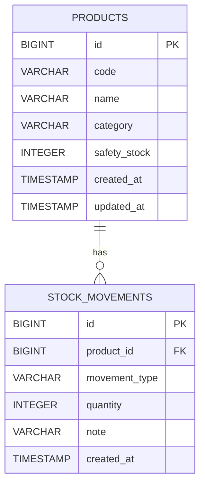

# InventoryManager

Spring Boot と MyBatis で作成する在庫管理アプリケーションです。

商品マスタ、入庫、出庫、在庫一覧、在庫検索、在庫アラートを管理できます。
`JobManager`、`AttendanceManager` に続く業務システム系ポートフォリオとして、SQL設計とトランザクション処理を説明できる構成を目指します。

## 概要

InventoryManager は、商品ごとの在庫数を入出庫履歴から集計するWebアプリケーションです。

Spring Data JPAではなく MyBatis を採用し、SQLを明示的に書くことで、JOIN、GROUP BY、CASE式、集計処理、DTOマッピングを学習できるようにしています。

## 主な機能

- ログイン / ログアウト
- 商品登録
- 商品一覧表示
- 商品検索
- 入庫登録
- 出庫登録
- 出庫時の在庫不足チェック
- 入出庫履歴表示
- 在庫一覧表示
- 在庫検索
- 安全在庫数による在庫アラート
- 初期サンプルデータ投入
- Docker ComposeによるPostgreSQL同時起動

## 使用技術

- Java 21
- Spring Boot 3.5.15
- Spring Web
- Spring Security
- Thymeleaf
- MyBatis
- PostgreSQL
- Maven
- Docker Compose
- JUnit

## MyBatisで学ぶポイント

- MapperインターフェースとXML Mapperの対応
- SQLを自分で記述するRepository層
- `JOIN` による商品と入出庫履歴の結合
- `GROUP BY` と `SUM` による在庫数集計
- `CASE` 式による入庫・出庫の加減算
- DTO `StockSummary` への集計結果マッピング
- `@Transactional` による入出庫処理の整合性確保

## ディレクトリ構成

```text
src/main/java/com/example/inventorymanager
├── config
│   └── SecurityConfig.java
├── controller
│   ├── LoginController.java
│   ├── ProductController.java
│   └── StockController.java
├── dto
│   └── StockSummary.java
├── entity
│   ├── MovementType.java
│   ├── Product.java
│   └── StockMovement.java
├── mapper
│   ├── ProductMapper.java
│   └── StockMovementMapper.java
└── service
    ├── ProductService.java
    └── StockMovementService.java
```

```text
src/main/resources
├── mappers
│   ├── ProductMapper.xml
│   └── StockMovementMapper.xml
├── static/css/app.css
├── templates
│   ├── products
│   └── stocks
├── application.properties
├── application-docker.properties
├── schema.sql
└── data.sql
```

## DB設定

`src/main/resources/application.properties` で PostgreSQL に接続します。

```properties
spring.datasource.url=jdbc:postgresql://localhost:5432/inventorymanager
spring.datasource.username=postgres
spring.datasource.password=${DB_PASSWORD}
mybatis.mapper-locations=classpath:mappers/*.xml
mybatis.configuration.map-underscore-to-camel-case=true
```

DBパスワードは環境変数 `DB_PASSWORD` に設定します。

PowerShell の例:

```powershell
$env:DB_PASSWORD="your_postgres_password"
```

## 起動方法

PostgreSQL に `inventorymanager` データベースを作成します。

```sql
CREATE DATABASE inventorymanager;
```

その後、プロジェクト直下で起動します。

```powershell
.\mvnw.cmd spring-boot:run
```

ブラウザで以下にアクセスします。

```text
http://localhost:8080/products
```

## Docker Composeでの起動

Docker Desktop が起動している状態で、以下を実行します。

```powershell
docker compose up --build
```

アプリケーションとPostgreSQLがまとめて起動します。

```text
http://localhost:8081/products
```

停止する場合:

```powershell
docker compose down
```

## テスト実行

Pleiades同梱のJava 21を使ってテストを実行するスクリプトを用意しています。

```powershell
.\scripts\test.ps1
```

## 初期ユーザー

現時点では、Spring Securityのインメモリユーザーを使用しています。

```text
ユーザー名: admin
パスワード: password
```

## 画面

- `/login` ログイン画面
- `/products` 商品一覧画面
- `/products/new` 商品登録画面
- `/stocks` 在庫一覧画面
- `/products/{id}/movements` 入出庫履歴・入出庫登録画面

## ER図



## 在庫集計SQLの考え方

在庫数は、商品テーブルに現在庫数を直接保存せず、入出庫履歴から集計します。

```sql
SELECT
    p.id,
    p.code,
    p.name,
    COALESCE(SUM(
        CASE
            WHEN sm.movement_type = 'IN' THEN sm.quantity
            WHEN sm.movement_type = 'OUT' THEN -sm.quantity
            ELSE 0
        END
    ), 0) AS stock_quantity
FROM products p
LEFT JOIN stock_movements sm
    ON sm.product_id = p.id
GROUP BY p.id, p.code, p.name;
```

このSQLをMyBatis Mapper XMLに記述し、画面表示用DTOへマッピングします。

## 今後追加したい機能

- CSV出力
- 商品編集 / 削除
- 入出庫履歴の検索
- ページネーション
- DB認証によるユーザー管理
- README用スクリーンショット
